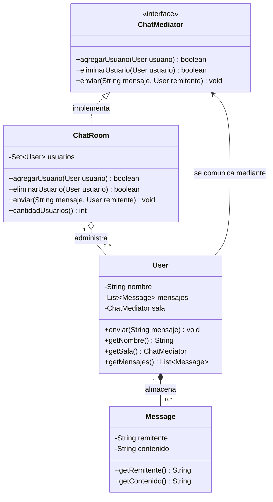

# Escenario 3 — Chat grupal

## Escenario

Estás desarrollando una aplicación de chat grupal. Los usuarios pueden
enviarse mensajes entre sí dentro de una sala de chat. Sin embargo, gestionar
las interacciones directas entre cada usuario haría que cada uno deba conocer y
comunicarse con todos los demás, lo que resulta en una alta dependencia entre
objetos.

## Problema

Sin un mediador, cada usuario tendría que mantener referencias directas a todos
los demás, lo que genera un sistema difícil de escalar y mantener. Si agregas o
eliminas usuarios, debes actualizar muchas relaciones.

## Beneficios esperados de la solución

- **Facilita el mantenimiento:** agregar o eliminar usuarios no debe requerir
  modificar los demás.
- **Mejor organización:** la lógica de comunicación debe estar centralizada y
  no dispersa en muchos objetos.
- **Reduce la complejidad:** evita una red enmarañada de interacciones punto a
  punto.

## Tipo de patrón

**Comportamiento.**

Los patrones de comportamiento se ocupan de la comunicación y asignación de
responsabilidades entre objetos. En este escenario, el problema principal no
es la creación ni la composición estructural de los usuarios, sino la forma en
que colaboran y se envían mensajes.

## Patrón

**Mediator (Mediador).**

Es la solución más adecuada para evitar que cada usuario tenga que conocer y
comunicarse directamente con todos los demás. El patrón introduce un objeto
mediador que concentra las interacciones del grupo. En esta implementación,
`ChatRoom` actúa como mediador concreto y los objetos `User` son los colegas.

Cada usuario conoce únicamente el contrato `ChatMediator`. Cuando un usuario
envía un mensaje, se lo entrega al mediador; `ChatRoom` determina quiénes deben
recibirlo y lo distribuye. De esta manera, los participantes permanecen
desacoplados.

El patrón satisface directamente los beneficios solicitados:

- **Facilidad de mantenimiento:** `ChatRoom.agregarUsuario()` y
  `ChatRoom.eliminarUsuario()` administran los participantes. Los demás
  usuarios no requieren cambios ni nuevas referencias cuando alguien entra o
  sale.
- **Mejor organización:** la lógica de registro, retiro y distribución de
  mensajes reside en `ChatRoom`. La clase `User` solamente solicita el envío y
  recibe los mensajes que le entrega el mediador.
- **Reducción de complejidad:** en lugar de tener múltiples relaciones entre
  todos los usuarios, cada `User` mantiene una sola referencia a
  `ChatMediator`.
- **Bajo acoplamiento:** los usuarios no dependen de `ChatRoom` directamente,
  sino de la interfaz `ChatMediator`, permitiendo sustituir la implementación
  de la sala en el futuro.
- **Escalabilidad:** nuevos usuarios pueden incorporarse dinámicamente sin
  modificar las clases existentes ni reconstruir una red de conexiones.

## Diagrama de clases



## Participantes

- `ChatMediator`: interfaz del mediador.
- `ChatRoom`: mediador concreto que administra y comunica a los participantes.
- `User`: colega que envía y recibe mensajes mediante el mediador.
- `Message`: valor inmutable que almacena un mensaje recibido.
- `ChatApplication`: demostración ejecutable.

## Compilar y ejecutar

Desde la carpeta `escenario3`:

```bash
mkdir -p out
javac -d out src/main/java/escenario3/*.java src/test/java/escenario3/*.java
java -cp out escenario3.ChatApplication
java -cp out escenario3.ChatRoomTest
```

La implementación es compatible con Java 11 y no requiere dependencias
externas.
